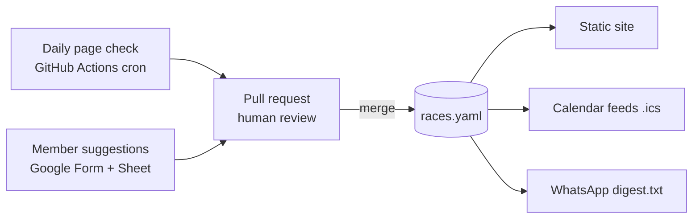

# UK Race & Ballot Tracker

A free, self-updating list of major UK races that tells the run club when ballots open and close. It's built in spare time; the first version is live and full automation is planned for mid-November 2026. Running costs are £0.

> Always confirm dates on the official site. Not affiliated with any race.

## Development

Requires Python 3.11+.

```bash
py -m venv .venv
.venv\Scripts\activate          # macOS/Linux: source .venv/bin/activate
pip install -r requirements.txt
python build.py                 # validate races.yaml, write site/ and the .ics feeds
python -m pytest                # run the tests
```

- `races.yaml` is the data. Edit it, then run `python build.py` to check it.
- `schema/races.schema.json` is generated from the Pydantic model in `tracker/models.py`. Run `python build.py --write-schema` after changing the model.
- `site/` is build output and is not committed. GitHub Actions builds and deploys it to GitHub Pages on every push to `main` and once a day. In CI the site address comes from the repo's Pages settings, so moving the repo needs no code changes. The "Suggest a race or report a change" link is hidden until the `SUGGEST_URL` repository variable is set (planned: the Google Form). Local builds use `http://localhost:8000`; preview with `python -m http.server 8000 --directory site`.
- `python check_pages.py` checks every race's official page for changes (snapshots go in `state/`, which is not committed). The daily **Check race pages** Action runs it with `--issues`, which opens a `page-change` issue with the text diff when a page changes, and a `page-unreachable` issue when a page has failed to load for 7 days (closed automatically when it loads again). To test the alert sooner, run the workflow by hand with a lower *alert after days*. Its snapshots are kept in the Actions cache, so race sites' text isn't republished in this public repo; if the cache is lost, the next run just takes fresh snapshots.
- Visits and subscribe-button clicks are counted with [GoatCounter](https://www.goatcounter.com/) (no cookies, no personal data). It's switched on by the `GOATCOUNTER_URL` repository variable (Settings → Secrets and variables → Actions → Variables). Local and pull-request builds never count. Stats: https://ukracetracker.goatcounter.com

---

## Overview

**Problem.** Race and ballot news reaches the WhatsApp group as scattered posts. People miss ballot windows because nobody tracks them in one place.

**Goals**

- One list of 30–60 major UK races with race dates and entry windows
- Reminders before each ballot opens and closes, with no manual effort from members
- Data that updates itself, with a person approving changes
- £0 running costs, using free tiers only

**Non-goals (for now)**

- Every small local race in the UK
- A bot posting inside the WhatsApp group
- User accounts, logins or a mobile app
- Handling race entries or payments

**Success criteria**

- At least 20 club members subscribed to the calendar within a month of launch
- No missed ballot for a listed race in the first season (Sep–Jan)
- Every entry verified against its official page in the last 14 days
- Under 30 minutes a week of maintenance

## Scope and data model

Start with a hand-picked list of about 40 races, chosen by the club. A short, accurate list beats a long one with wrong dates.

**Inclusion rule:** a race joins the list if it is a 10K or longer, in the UK, and either uses a ballot or sells out within weeks. Members can propose others (see Community input).

**Starter candidates** (race months and entry types are approximate; confirm each on its official site in Phase 1):

| Race | Distance | Usual month | Entry type |
| --- | --- | --- | --- |
| London Marathon | Marathon | April | Ballot + charity + good-for-age |
| Manchester Marathon | Marathon | April | General entry |
| Brighton Marathon | Marathon | April | General entry |
| Edinburgh Marathon | Marathon | May | General entry |
| Hackney Half | Half | May | General entry |
| Bath Half | Half | March | General entry |
| Great North Run | Half | September | Ballot |
| Royal Parks Half | Half | October | Ballot + charity |
| Great Scottish Run | Half | October | General entry |
| Cardiff Half | Half | October | General entry |
| London 10,000 | 10K | May | General entry |

International majors (Berlin, Chicago, New York, Tokyo, Sydney, Boston) can be added later as their own category. Their ballots matter to UK runners too.

**Added by the group (Oct 2026):** London Landmarks Half, Kew Gardens 10K, Kew Gardens Half, and three international races: Paris Marathon, Berlin Half Marathon and Milan Marathon. International races carry a `country` and can be filtered on the site.

**Data model.** Each race is one record in `races.yaml`. Each year's edition is its own record, so past dates stay as history.

| Field | Type | Example | Notes |
| --- | --- | --- | --- |
| `id` | string | `london-marathon-2027` | slug + year, unique |
| `name` | string | London Marathon |  |
| `distance` | enum | marathon / half / 10k / ultra / other |  |
| `location` | string | London | city or region |
| `country` | string | France | defaults to `UK` |
| `race_date` | date | 2027-04-25 | blank if unannounced |
| `race_date_end` | date | 2027-04-26 | only for races held over several days |
| `entry_type` | list | ballot, general, charity, gfa |  |
| `ballot_opens` | datetime | 2026-04-27T10:00 | UK time |
| `ballot_closes` | datetime | 2026-05-02T12:00 |  |
| `ballot_results` | date | 2026-07-01 |  |
| `general_entry_opens` | datetime |  | for first-come races |
| `price_gbp` | number | 79 | optional |
| `official_url` | url |  | the page that gets monitored |
| `source_url` | url |  | where the date was seen |
| `status` | enum | unannounced / announced / ballot_open / ballot_closed / sold_out / done |  |
| `last_verified` | date | 2026-10-01 | shown on the site |
| `confidence` | enum | confirmed / expected / estimated | estimated = based on last year |
| `monitoring` | enum | auto / manual | defaults to `auto`; `manual` for sites that block the daily check |
| `notes` | text |  | short, plain |

The `confidence` field matters most. Before a ballot is announced, the site can show “expected late April, based on 2026” instead of a fake exact date. Only `confirmed` records go into the calendar feeds.

## Architecture and free stack

The whole system is a GitHub repo. A YAML file holds the data, GitHub Actions does the work, pull requests are the review queue and GitHub Pages serves the results. There's no server or database to run.



Both inputs, the daily page check and member suggestions, end as a pull request. Only a merged PR changes `races.yaml`, and each merge rebuilds the site, the calendar feeds and the WhatsApp digest.

| Layer | Tool | Cost |
| --- | --- | --- |
| Data store | `races.yaml` in the GitHub repo (move to Supabase free tier only if you outgrow it) | Free |
| Scheduler and CI | GitHub Actions (daily cron, build on merge) | Free for public repos |
| Fetch and clean | Python, `httpx`, `lxml`; Playwright only for JavaScript-heavy sites | Free |
| Date extraction | Gemini API free tier, Groq free tier, or Ollama locally | Free tier |
| Validation | Pydantic + custom rules | Free |
| Review queue | GitHub pull requests (approve from phone or web) | Free |
| Website | Astro or Eleventy on GitHub Pages (or Cloudflare Pages) | Free |
| Calendar feeds | Python `icalendar` | Free |
| Submissions | Google Forms + Sheets API | Free |
| Email digest (optional) | Buttondown or Resend free tier | Free tier |
| Monitoring | GitHub Actions failure emails; an issue opened when a page goes 7 days without a valid fetch | Free |

## Data pipeline

The pipeline checks each official race page once a day and turns any change into a pull request for a person to approve. Nothing reaches the live site without a review.

1. **Fetch.** A Python script (`httpx`) downloads each `official_url`. It honours robots.txt, sends a clear user agent (e.g. `RunClubRaceBot/0.1 (+repo link)`) and waits a few seconds between requests.
2. **Clean.** Keep the page's visible text and drop scripts, styles, menus, footers and forms. This keeps hashes stable and LLM prompts short. (We tried `trafilatura` first, but it dropped dates shown in page banners, such as the Bath Half race date.)
3. **Detect change.** Hash the cleaned text and compare it with the hash stored in `state/pages.json`. If nothing changed, stop; most days nothing will. Until the LLM step exists, a change opens a GitHub issue with the text diff.
4. **Extract.** For changed pages only, send the text to an LLM with a fixed JSON schema (the date fields from the data model). The prompt tells it to return `null` when a date isn't stated, and to quote the sentence each date came from.
5. **Validate.** Check the output with Pydantic. Reject impossible results: a ballot closing before it opens, a race date in the past, or a quoted sentence that doesn't appear in the page.
6. **Propose.** Write the changes to `races.yaml` on a new branch and open a pull request. The PR shows the old value, the new value and the quoted sentence.
7. **Review.** A maintainer checks the PR against the source link and merges it. Merging triggers the site and calendar rebuild.

**Free LLM options** (free-tier limits change often; check before building):

- Google Gemini API free tier (Flash models): enough for a few dozen calls a day
- Groq free tier (open-weight models such as Llama)
- Local model through Ollama on your laptop, if you'd rather run extraction by hand
- Fallback with no LLM: regex for common date formats, with every hit flagged for review

At about 40 races, roughly 2–5 pages change on a typical day, so a free tier is plenty.

**Pages that are hard to read**

- *JavaScript-only sites:* use Playwright in GitHub Actions (free, but slower), and only for the races that need it.
- *Dates only on social media or in emails:* don't scrape these. Mark the race `manual` and rely on community submissions.
- *PDF entry packs:* extract the text with `pypdf`, then use the same LLM step.

**Evaluation.** Keep a test set of 20–30 saved pages with known correct dates. Run extraction against it in CI whenever the prompt or model changes, and track accuracy per field. This is also the strongest portfolio piece in the project.

**Community input.** A Google Form (name of race, link, what changed) feeds a Google Sheet. A weekly job reads the sheet with the Sheets API and opens a PR for each new row, through the same validation and review.

## Website, calendar and reminders

Members get reminders by subscribing to a calendar feed once. There are no accounts and no stored personal data.

**Website (static).** Built from `races.yaml` on every merge. Astro or Eleventy both work; a single page with a little vanilla JS is also enough.

- “Upcoming deadlines” at the top: ballots opening or closing in the next 30 days
- Full race table with filters for distance, month and entry type
- Each race shows its status, a “last verified” date and a link to the official page
- A “Suggest a race / report a change” link to the Google Form
- Calendar subscribe buttons (Google, Apple, Outlook) with one-line instructions

**Calendar feeds (.ics).** Generated with the Python `ics` or `icalendar` library and published alongside the site.

- `all.ics`, plus `marathons.ics`, `halves.ics` and `ballots-only.ics`
- Every entry window creates events for “Ballot opens”, “Ballot closes in 2 days” and “Ballot closes today”. Each event links to the entry page.
- Race days are all-day events.
- Stable event UIDs (e.g. `london-marathon-2027-ballot-opens`), so an updated date moves the existing event instead of duplicating it.

Two gotchas. Google Calendar ignores alarms in subscribed feeds, which is why the reminder is its own event (“closes in 2 days”) instead of an alert. Google also refreshes subscribed feeds slowly, sometimes taking a day, so announce last-minute changes in the group too.

**Email digest (optional, Phase 3).** A weekly “this week in ballots” email, built from the same data. Free options: Buttondown or Resend free tiers (check current limits). Use double opt-in and include an unsubscribe link.

**WhatsApp distribution.** Don't put a bot in the group. Unofficial libraries (whatsapp-web.js, Baileys) break WhatsApp's terms and can get the number banned. The official Business API needs a business number and charges per message.

- Pin the site and calendar link in the group description
- The pipeline also writes `digest.txt`, a ready-to-paste weekly WhatsApp message with emoji-free plain text and links. A club admin pastes it on Mondays.
- If the club later wants push alerts, a Telegram channel and bot are free and allowed.

## Delivery plan

Engineer 1 is building the project at about 6–8 hours a week. Engineer 2 has repo access but hasn't started yet; their work is parked in the backlog below and will be planned when they join.

### Where we are (Oct 2026)

Phase 1 is nearly done; the remaining steps are about the club, not code.

- [x] Repo, data model and JSON Schema (`races.yaml`, `tracker/models.py`, `schema/races.schema.json`)
- [x] `build.py`: validates the data and generates the `.ics` feeds and the static site
- [x] Site with an "upcoming deadlines" panel, subscribe buttons, phone and removal help, and filters (region, distance, entry type, month)
- [x] GitHub Actions: test, build and deploy to GitHub Pages on every push and daily
- [x] Repo moved to the `ukracetracker` organisation; site at https://ukracetracker.github.io/uk-race-tracker/
- [x] 17 races entered by hand; 14 confirmed against official pages
- [ ] Share the link and subscribe instructions in the WhatsApp group; pin it
- [ ] Grow the list to 30–40 races agreed with the group
- [ ] Confirm Paris Marathon, Royal Parks Half and Great Scottish Run 2027 once published

*Phase 1 done when:* 10 members have subscribed and the deadlines on the page match the official sites.

### Engineer 1: data and pipeline

| Week of | Work |
| --- | --- |
| 5 Oct | Finish Phase 1: share and pin the link, grow the race list |
| ~~12 Oct~~ done 2 Oct | Fetch and clean with robots.txt checks and rate limiting |
| ~~19 Oct~~ done 2 Oct | Hash store, daily Action, open an issue with a text diff when a page changes |
| ~~26 Oct~~ done 2 Oct | Monitoring: alert after 7 days without a valid fetch (blocked sites already marked `manual`: Great North Run, Great Scottish Run, Paris) |
| 2 Nov | LLM extraction prompt, JSON output and validation |
| 9 Nov | PR bot: proposed field changes with quoted evidence |
| 16 Nov | Evaluation set of 20–30 saved pages, run in CI |

**Milestones**

- *Change detection (Phase 2), by end of October:* a real ballot announcement is caught within 24 hours. This matters now: ballot season runs Sep–Jan, and the Great North Run January ballot is the next big one.
- *Automation (Phase 3), by mid-November:* most changes arrive as ready-to-merge PRs and review takes under 30 minutes a week.

### Backlog: delivery and community (unassigned)

These read from `races.yaml` and don't block the pipeline. They are the natural lane for Engineer 2 when they join; until then Engineer 1 picks them up only if there's spare time.

- [ ] `CONTRIBUTING.md`: how to add or update a race
- [ ] `digest.txt`: weekly ready-to-paste WhatsApp message, built by `build.py`
- [ ] Google Form + Sheet for suggestions, and a weekly job that turns new rows into GitHub issues
- [ ] Site polish from member feedback
- [ ] Optional: weekly email digest

**Parked until there's community feedback**

- Pick individual races for your calendar. Preferred approach: one feed per race named by slug without the year (e.g. `races/london-marathon.ics`, so it rolls over to next year's edition), with Google/Apple/Outlook buttons on each row, alongside the group feeds. If members want several races in one calendar, add a small free Cloudflare Worker that builds a combined feed from a list of races. Avoid one-off "add event" links: they never update when a date changes.

### Ongoing (from late November)

- [ ] Review bot PRs (busiest Sep–Jan, when most ballots run)
- [ ] Roll each race into next year's edition once results are out
- [ ] Recruit a non-technical reviewer from the club who can approve data PRs in the GitHub web UI

**Risk while working alone:** Engineer 1 is the only reviewer, so a busy fortnight means stale data. The daily change-detection issues make it obvious what's waiting, and Engineer 2 or a club reviewer can approve data PRs in the GitHub web UI as a backup.

## Costs, risks and open questions

The whole project runs at £0 a month. The only optional cost is a custom domain at about £10 a year; the free `username.github.io` address works fine.

**Free-tier limits to watch** (check current terms before building):

- *GitHub Actions:* free for public repos on standard runners. A private repo gets a monthly minute allowance, which a daily job uses only a small part of.
- *GitHub Pages:* 1 GB site size and a soft limit of 100 GB bandwidth a month, far more than a club needs.
- *LLM free tiers:* rate limits and models change. Keep the extraction step behind one small function so you can swap providers.
- *Email tiers:* subscriber or daily-send caps. Calendar feeds have no such limit, which is one more reason to make them the main channel.

**Risks**

| Risk | Impact | Mitigation |
| --- | --- | --- |
| Wrong ballot date published | Members miss a ballot | Human review on every change; quoted evidence; “last verified” shown; official link on every entry |
| Race site redesign breaks extraction | Silent stale data | Alert when a page fails to fetch or extraction returns nothing for 7 days |
| Maintainer burnout | Project stops | Backup reviewer (Engineer 2 or a club member); under 30 min a week target; keep scope to about 40 races |
| Site blocks the bot | No updates for that race | Mark as `manual`; rely on community submissions |
| Free tier withdrawn | Pipeline step stops | Provider-agnostic code; regex fallback; GitHub alternatives (Cloudflare Pages, GitLab CI) |

**Legal and privacy**

- Monitor official race pages only. Aggregators such as Let's Do This and Finishers usually forbid scraping in their terms.
- Respect robots.txt, keep to one request per page a day and identify the bot.
- Store facts (dates, prices) and link to the source. Don't copy race descriptions, logos or photos.
- Calendar feeds collect no personal data. If you add email, GDPR applies: get explicit consent, use double opt-in, provide an unsubscribe link and a short privacy note, and store only email addresses.
- Add a disclaimer: “Always confirm dates on the official site. Not affiliated with any race.”

**Open questions**

- [x] Which races go on the first list? (Ask the group.) First suggestions added Oct 2026.
- [x] Include international majors from day one, or later? From day one: Paris, Berlin Half and Milan.
- [x] Who besides you can approve PRs? Engineer 2 has access as a backup; a non-technical club reviewer is still wanted.
- [ ] Public repo (free Actions, open to contributors) or private?
- [ ] Is a weekly WhatsApp digest wanted, and who posts it?
- [ ] Should the project carry the club's name, or stay independent?
